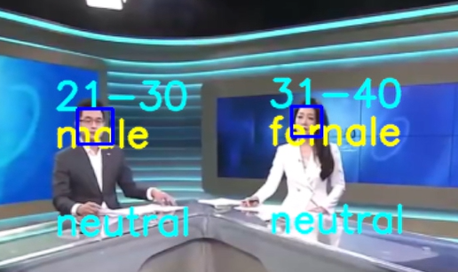

# Facial Recognition Classification

## Fetures

By leveraging the `haarcascade_frontalface_default` [haarcascade_frontalface_default](https://github.com/kipr/opencv/blob/master/data/haarcascades/haarcascade_frontalface_default.xml) from OpenCV, we can isolate the human face region and detect three key attributes of the individual:

* **Age:**  The estimated age of the person.
* **Age Range:** The estimated age range of the person.
* **Emotion:** The detected emotion expressed by the person.

### Demonstration Image and Video
This image demonstrates the face detection and attribute prediction process. 
- Image

 

- Video

 


## Installation

Install all required libraries by running the following command in your terminal:

```bash
pip install -r requirements.txt
```

This will install all necessary packages as specified in the `requirements.txt` file. 


This is my recognition project. 

## Input Options

You can choose your input source via the GUI:

* **Webcam:**  Select either "Camera 0" or "Camera 1" (or other available cameras).
* **Video:** Upload a video file.
* **Image:** Upload an image file.

## Installation

Install all required libraries by running the following command in your terminal:

```bash
pip install -r requirements.txt
```

This will install all necessary packages as specified in the `requirements.txt` file.

## Run App

```
cd IS_project_source_code/source_code

python main.py
```

## GUI Design with Tkinter

The GUI is built using Python's Tkinter library and includes the following components:

**(1) File Path Display:** Displays the path of the uploaded image/video file.

**(2) Input File Type:** Shows the supported input file types:
* **Image:**  Predicts on images.
* **Video:** Predicts on videos.
* **Camera:** Predicts using the webcam.

**(3) Browse:** Allows users to select an image/video file.

**(4) PLAY:** Starts the prediction process.

**(5) STOP:** Stops the processing.

### Output Display

* **Face Capture and Prediction:** Displays the detected face and prediction results using OpenCV. 

### Prediction Results

* **Gender:**  "Male" or "Female".
* **Age:**  Classified into one of the 9 age groups defined in section III.3 (Pre-processing).
* **Emotion:**  One of the 7 emotions from the FER-2013 dataset: Angry, Disgust, Fear, Happy, Sad, Surprise, Neutral. 
